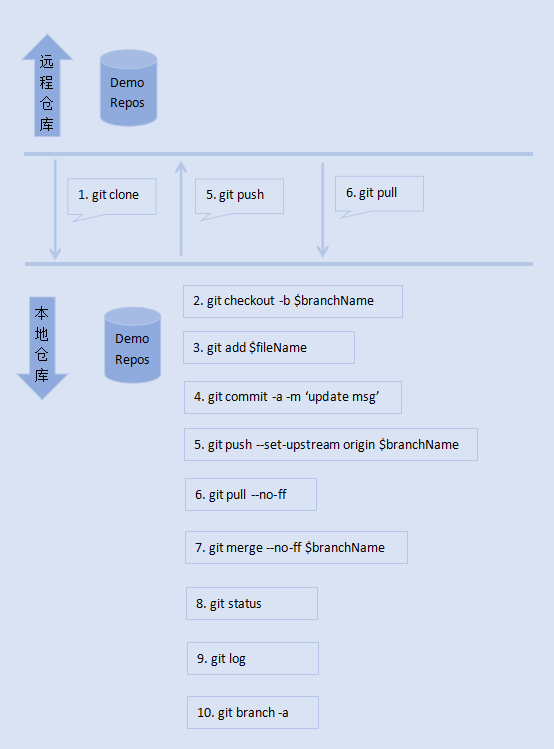
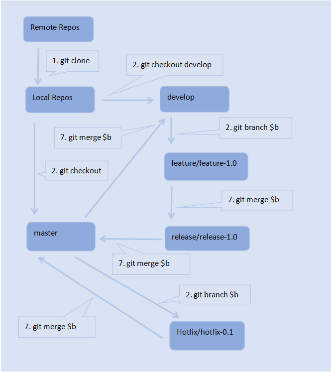

# Git 常用命令与分支流程
本项目从初始化仓库、分支规划、分支流转等方面进行介绍，为开发团队的Git推广提供参考。


## Git 常用命令


## Git 命令解释
- 1: git clone $url :
克隆远程仓库到本地
- 2: git checkout -b $branchName
创建并选中分支$branchName
等价于：
```
git branch $branchName # 创建分支
git checkout $branchName # 切换分支
```

- 3: git add $filePath
将文件添加至暂存区
- 4: git commit -a -m ‘update msg’
将暂存区的文件提交至本地仓库
- 5: git push --set-upstream origin $branchName
将本地仓库的更新推送至远程仓库
- 6: git pull --no-ff
拉取远程仓库的更新，并合并至本地仓库。

```
--no-ff : 非快进式
git fetch 拉取远程仓库的更新
git merge 合并分支
```

- 7: git merge --no-ff $branchName
将$branchName分支合并到当前分支，非快进式。
- 8: git status
查看文件修改情况
- 9: git log
查看提交记录
- 10: git branch -a
查看所有分支信息


## Git 分支管理
- 产品分支：master
- 开发分支：develop
- 功能分支前缀：feature/
- 发布分支前缀：release/
- 修复分支前缀：hotfix/

## Git 分支流转


## 脚本介绍
- 脚本 0 ： 克隆一个现有仓库
- 脚本 1 ： 初始化一个仓库
- 脚本 2 ： 创建分支
- 脚本 3 ： 在功能开发分支上进行开发
- 脚本 4 ： 解决文件合并的冲突
- 脚本 5 ： 主分支间合并


## script 0 : clone this project repository
- 1: clone repository

```
git clone https://github.com/xiangtao123/git-workflow-demo.git
```


## script 1 : master init project repository
- 1: add README.md file

```
cd /工作空间目录/lab-workspace-prod # 进入工作空间目录
mkdir git-workflow-demo # 创建项目目录
vim README.md # 创建README.md文件
```

- 2: init project repository at local

```
git init # 将当前目录初始化为git repository
```

- 3: add new file to stage

```
git add README.md # 将README.md 文件添加到暂存区stage
git status # 查看已修改的文件
```

- 4: commit new file

```
# 配置当前项目的git用户
git config user.name "用户名"
git config user.email "用户邮箱地址"

git commit -a -m 'add README.md file' # 提交修改文件到本地仓库
git log # 查看文件更新提交记录

```

- 5: push to remote repository

```
git remote add origin https://github.com/用户名/git-workflow-demo.git # 本地仓库与远程仓库关联
git push origin master # 将本地仓库的修改推送到远程仓库
```


## script 2 : new branch
- 1: add develop branch

```
git checkout -b develop # 创建并选中分支develop
git push --set-upstream origin master# 推送到远程仓库
```
- 2: add feature/feature-1.0 branch

```
git branch -a # 查看所有分支
git push --set-upstream origin master # 推送到远程仓库

```


## script 3 : develop new feature at feature/feature-1.0 branch

- 1: add website/index.html file

```
mkdir website # 创建目录
cd website # 进入目录
vim index.html # 编辑index.html文件内容

git add * # 将所有文件修改添加到暂存区
git commit -m 'feature/feature-1.0, add website/index.html file' # 将所有文件修改提交到本地仓库
git push --set-upstream origin feature/feature-1.0 # 将分支文件修改推送至远程仓库

```


- 2: add branch release/release-1.0

```
git branch -a # 查看所有的分支
git checkout develop # 切换至开发主干分支
git checkout -b release/release-1.0 # 创建并切换至 release/release-1.0 分支
git push --set-upstream origin release/release-1.0 # 将分支推送到远程仓库

```

- 3: merge feature/feature-1.0 into release/release-1.0

```
git branch -a # 查看所有分支
git checkout release/release-1.0 # 切换分支
git merge --no-ff feature/feature-1.0 # 将feature/feature-1.0分支合并到当前分支，非快进式
```


## script 4 : resolve conflicts

- 1: add and update member info

```
git pull # 拉取远程仓库的修改，快进式。git fetch & git merge
git bracn -a # 查看所有分支
git checkout release/release-1.0 # 切换分支
vim website/index.html # 编辑文件内容，增加新成员并修改成员信息

git add website/index.html # 添加至暂存区
git commit -a -m 'alter index.html, add and update member info' # 提交至本地仓库
git push --set-upstream origin release/release-1.0 # 推送至远程仓库

```

- 2: 冲突信息：
```
git pull --no-ff
remote: Counting objects: 11, done.
remote: Compressing objects: 100% (8/8), done.
remote: Total 11 (delta 3), reused 9 (delta 1)
Unpacking objects: 100% (11/11), done.
From http://github.com/用户名/项目名
   2b56fe8..6a29eeb  release/release-1.0 -> origin/release/release-1.0
Auto-merging website/index.html
CONFLICT (content): Merge conflict in website/index.html
Automatic merge failed; fix conflicts and then commit the result.
```

- 3: 产生冲突的文件内容：

```
<html>
	<head>
		<title>index.html - demo project website</title>
		<meta charset="utf8" />
	</head>	
	<body>
		<h1>Demo Project Index Page.</h1>
                
		<h4>About us:</h4>
		<ul>
<<<<<<< HEAD
			<li>1. czy</li>	
=======
			<li>1. Elsie</li>
			<li>2. sunburst</li>
>>>>>>> 6a29eeb0d9cb5ef6e8490df2769adf5302ee164e
		</ul>

	</body>
	
</html>
```


- 2: pull update & resolve conficts

```
git checout release/release-1.0 # 切换分支
git pull --no-ff # 拉取和合并远程仓库更新，非快进式。

vim website/index.html # 此时，会得到一个冲突信息，编辑对应文件，
git add website/index.html # 将文件添加至暂存区，
git commit -a -m 'alter index.html, fixed merge conficts' # 提交至本地仓库
git push --set-upstream origin release/release-1.0 # 将本地仓库更新推送至远程仓库

```


## script 5 : merge release branch into develop, master
- 1: merge release branch into develop

```
git checkout develop # 切换开发分支
git merge --no-ff release/release-1.0 # 将release/release-1.0分支合并到当前分支，非快进式
git push --set-upstream origin release/release-1.0 # 将本地仓库的更新推送至远程仓库
```

- 2: add hotfix branch, for fix bug

```
git checkout master # 切换分支
git checkout -b hotfix/hotfix-0.1 # 创建并切换分支hotfix/hotfix-0.1
git push --set-upstream origin hotfix/hotfix-0.1 # 将本地仓库的更新推送至远程库

```

- 3: merge hotfix branch into master

```
git checkout master # 切换分支
git merge --no-ff hotfix/hotfix-0.1 # 将hotfix/hotfix-0.1分支合并至当前分支，非快进式
git push --set-upstream origin develop # 将本地仓库的更新推送至远程仓库
```


- 4: merge release branch into master

```
git checkout master # 切换分支
git merge --no-ff release/release-1.0 # 将release/release-1.0分支合并至当前分支，非快进式
git push --set-upstream origin release/relase-1.0 # 将本地仓库的更新推送至远程仓库
```

- 5: merge master branch into develop

```
git checkout develop #切换分支
git merge --no-ff master # 将master分支合并至当前分支，非快进式
git push --set-upstream origin develop # 将本地仓库的更新推送至远程仓库
```

# Git Flow
- Flow 1 : Master->develop->feature->release->develop->Master
- Flow 2 : Master->hotfix->Master
- Flow 3 : Master-develop


# 推荐Git 教程资料
- [官方文档](https://git-scm.com/book/zh/v2)  
- [中文资料](https://www.w3cschool.cn/git/) 


